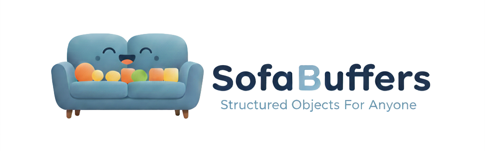

# SofaBuffers

<b>Structured Objects For Anyone</b> 
<i>... so optimized, feels amazing.</i>

[Would you like to know more?](https://github.com/sofa-buffers)

## SofaBuffers C/C++ library

[GitHub repository](https://github.com/sofa-buffers/corelib-c-cpp)

### Source documentation

[Documentation](https://sofa-buffers.github.io/corelib-c-cpp/)

### Supported languages

- <b>C99</b> or later
- <b>C++20</b> or later

### Built with following compilers

| Target | Status |
| - | - |
| GCC x86_64 (little endian) |  |
| Clang x86_64 (little endian) |  |
| GCC MIPS (big endian) |  |
| GCC PowerPC (big endian) |  |
| GCC RISCV-V 64 (little endian) |  |

### Who is this suitable for?

The C core library is very much aimed at small embedded devices, where C is simply essential. The focus here was therefore on minimal resource consumption.

The C++ core library is aimed more at IoT devices. Such devices do not necessarily run Linux directly, but they are powerful enough to deal with C++/Heap etc. However, the focus here was also on supporting IoT devices that do not support everything specified by C++ - for example, no exceptions are used, as these are often prohibited or not supported. Similarly, std::iostream is not used, as this is often not supported or simply too heavy.

### Features

Since the focus was on embedded devices, special attention was paid to the following features during implementation:

* **Keep it simple** and don't use anything too fancy.
* Fully streaming-capable to serialize **messages larger than the available memory**.
* The start of the message in the destination buffer can be defined by an offset value to reserve space for protocol headers of underlying protocols, thus **reducing the amount of copy operations**.
* Data can be serialized and deserialized **without heap** to avoid heap fragmentation.
* The corelib API should remain clearly structured so that it **can be used without a code generator**.
* **No dependencies** on other libraries to be embeddable.

### Is this C/C++ implementation zero-copy?

No. SofaBuffers focuses on generating as little protocol overhead as possible, which is why the words in the payload of a message are not always aligned.
To be compatible with all architectures, the data from the message is copied to user-provided memory.

### Footprint

This table shows the memory requirements of the C corelib for different bare metal architectures.

The lib was always built with `-Os` (optimized for minimal size).

#### Full configuration

| Architecture | .text | .data | .bss
| - | - | - | -
| ARMv6-m |            ~2.6KB | 0.0KB | 0.0KB
| ARMv7-m+fp.dp |      ~2.7KB | 0.0KB | 0.0KB
| ARMv8-m.main+fp |    ~2.7KB | 0.0KB | 0.0KB
| ARMv8.1-m.main+mve | ~2.7KB | 0.0KB | 0.0KB
| atmega8 |            ~6.3KB | 0.0KB | 0.0KB

#### Minimal configuration

| Architecture | .text | .data | .bss
| - | - | - | -
| ARMv6-m |            ~1.0KB | 0.0KB | 0.0KB
| ARMv7-m+fp.dp |      ~1.1KB | 0.0KB | 0.0KB
| ARMv8-m.main+fp |    ~1.1KB | 0.0KB | 0.0KB
| ARMv8.1-m.main+mve | ~1.1KB | 0.0KB | 0.0KB
| atmega8 |            ~2.6KB | 0.0KB | 0.0KB

corelib API without `object.c`:

| Architecture | .text | .data | .bss
| - | - | - | -
| ARMv6-m |            ~0.8KB | 0.0KB | 0.0KB
| ARMv7-m+fp.dp |      ~0.9KB | 0.0KB | 0.0KB
| ARMv8-m.main+fp |    ~0.9KB | 0.0KB | 0.0KB
| ARMv8.1-m.main+mve | ~0.9KB | 0.0KB | 0.0KB
| atmega8 |            ~1.9KB | 0.0KB | 0.0KB